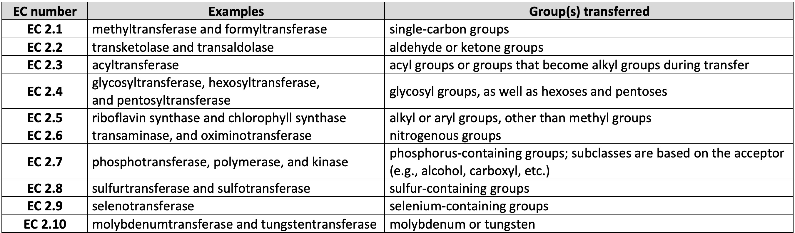

# Enzymes classification

### Context 

Enzymes are classified by the Nomenclature Committee of the International Union of Biochemistry into Enzyme Comission (EC) numbers, a four digit numerical representation separated by periods (e.g. 2.6.1.9). 

The four levels of EC numbers are related to each other in a functional hierarchy. The first number describes one of the 7 main enzymatic classes, the second describes the subclass, the third represents the sub-subclass and the fourth refers to the substrate of the enzyme.

Here, we will predict the subclass for the class 2 (transferases).

### Dataset

We will use the ECPred dataset (Sequeira et al., 2021, ECPred: a tool for the prediction of the enzymatic functions of protein sequences based on the EC nomenclature.)
This dataset contain many enzymatics classes (1-7), the class 0 is not enzymatic. We only will work with the class 2. 

### Transferases

Transferases are enzymes that catalyse the transfer of a functional group from a donor molecule, often a coenzyme, to an acceptor molecule.
The different subclasses of this enzymes are presented in the table below.

## Autors:

- Alexandra Coelho (PG45458)
- Andreia Gomes (PG45463)
- Catarina Ferreira (PG45467)
- Daniela Lemos (PG45469)
